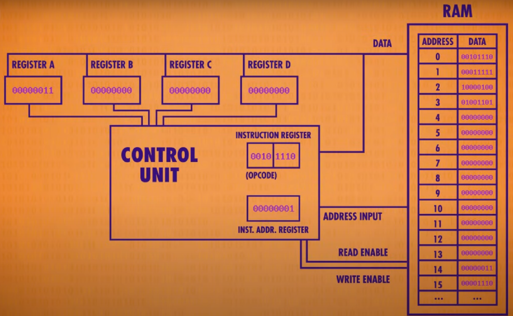
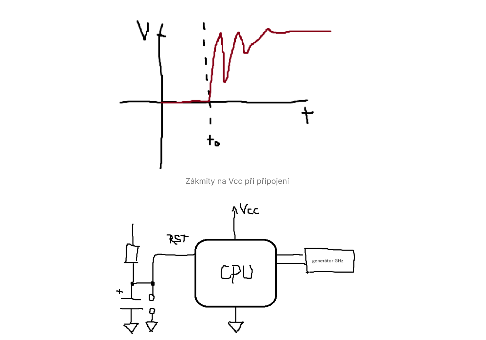
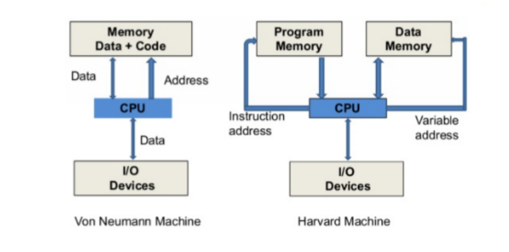

# Otázka 17

## Jednočipové mikropočítače a mikrokontrolery

- správce: Jirka
- stav: převedeno z archivu do nové stránky
- původní zdroj: [17. Jednočipové mikropočítače a mikrokontrolery](../archiv/skripta-kyb/kybernetika/chapters/17.%20Jednočipové%20mikropočítače%20a%20mikrokontrolery.md)

---

- PC = osobní počítač (*personal computer*)
- Jednočipový počítač = počítač realizovaný v jednom integrovaném obvodu
# Počítač
- **`CPU` (central processor unit)**: Hlavní procesor, který vykonává instrukce a provádí výpočty.
	- Jde o „mozek“ počítače, který řídí jeho ostatní části a vykonává samotné instrukce. Mezi známé výrobce procesorů pro osobní počítače patří například Intel a AMD.
	- Základní stavební jednotkou procesoru je tranzistor zapojený jako spínač. Jeho úkolem je měnit stav mezi logickou nulou a jedničkou. Jeden samotný tranzistor by příliš výpočtů realizovat nemohl, proto jich v dnešních procesorech nalezneme miliardy, díky čemuž je možné provádět i nejsložitější operace.
	- Interval mezi dvěma pulsy z oscilátoru se nazývá frekvenční cyklus. V takovém čase je procesor schopen své tranzistory přepnout do jedničky a poté zpět do nuly. O změně stavu z nuly do jedničky referujeme jako o náběžné hraně a o změně jedničky na nulu jako o hraně sestupné.
- **`RAM` (random access memory)**: Elektronická polovodičová dočasná paměť, která uchovává data a instrukce pro aktuální operace/programy. (zjednodušeně číslované buňky z nichž každá obsahuje hodnotu)
	- po odpojení se maže
	- počet zápisu a čtení není omezený
	- **volatilní** – při vypnutí napájení se informace smaže; takto se chovají polovodičové paměti RAM
	- **nevolatilní** – informace vydrží vypnutí napájení; tuto vlastnost mají magnetické paměti
- **`ROM` (read only memory)**: Trvalá paměť pro základní systémová data (např. BIOS). Její obsah je dán už při výrobě a není závislý na napájení (nemaže se po odpojení napájení)
	- pro uložení firmwaru (softwaru)
	- dříve více častý, dnes už se používá jen zřídka (z důvodu nemožnosti aktualizace softwaru, který obsahoval a taky protože RAMky jsou dnes mnohem rychlejší)
- **`GPU` (graphics processing unit)**: Grafická jednotka pro zpracování obrazu, promítnutí do monitoru, může být ale využit i k jiným výpočtům (kryptoměny)
- **`NPU` (Neural Processing Unit)**: je specializovaný procesor navržený k urychlení výpočtů spojených s umělou inteligencí (AI), zejména pro zpracování neuronových sítí a úloh strojového učení. (může se skládat z více CPU a GPU)
- **`I/O` (input/output)**: Výměna dat mezi PC a externími zařízeními (myš, monitor, disk, klávesnice...)

---

# Jak funguje procesor:
1. **Načtení instrukce** 
	Procesor načte instrukci z paměti podle adresy uložené v adresovém registru.
2. **Dekódování instrukce** 
	Řídicí jednotka zjistí, co instrukce znamená a jaký typ operace se má vykonat.
3. **Vykonání instrukce** 
	Podle typu instrukce se provede jedna nebo více následujících činností:
	- **Přenos dat** – například mezi registry nebo mezi pamětí a registrem.
	- **Aritmetická operace** – například sčítání, odčítání.
	- **Logická operace** – například porovnání hodnot, AND, OR, NOT.
	- **Ovládání toku programu** – podmíněné nebo nepodmíněné skoky, smyčky.
4. **Zvýšení adresového registru**
	Po dokončení instrukce se zvýší hodnota adresového registru, aby ukazoval na další instrukci.
5.  **Opakování celého cyklu**
	- **Registr** – malá, rychlá paměť pro dočasné uchování dat.
	- **Instrukční registr** – uchovává právě vykonávanou instrukci.
	- **Adresový registr** – uchovává adresu v paměti, ze které se čte/zapisuje.
	- **Aritmeticko-logická jednotka (ALU)** – provádí výpočty a logické operace.

---

# Připojení procesoru k napájení
Při zapnutí napájení mikrokontroléru nebo jednodeskového počítače (např. Arduino nebo Raspberry Pi Pico) nemusí být napětí `Vcc` ihned stabilní. Často dochází ke kmitání a přechodovým jevům. Pokud by se procesor spustil hned, mohlo by dojít k nesprávné inicializaci nebo chybné činnosti. Proto se používá resetovací pin `RST`, který zajistí, že se procesor spustí až tehdy, když je napětí stabilní.

Používá se kombinace kondenzátoru a rezistoru, kde časová konstanta $\tau$ je jejich součin. Ustálení typicky nastane přibližně po $3\text{ až }5~\tau$.

- Vstup generátoru hodin
- `Vcc` a `GND`

- Výstup `RST` - pin, který obstará správné spuštění procesoru i při zákmitech na napájení `Vcc`
	- Časová konstanta $\tau = R\cdot C$ (Tau = odpor * farady)
	- Vyjadřuje dobu, po kterou CPU čeká, než se spustí

---

# Von Neumann architektura
- Společná paměť pro data a instrukce
**Výhody:**
- Jednodušší architektura
- Flexibilnější programování
- Možnost modifikace programu za běhu
**Nevýhody**
- Rychlost zpracovávání instrukcí je podstatně vyšší než komunikace s pamětí → tzv. _memory wall_

# Harvardská architektura
- Oddělená paměť pro data a instrukce
**Výhody:**
- Vyšší bezpečnost (nelze snadno modifikovat kód)
- Možnost současného přístupu k datům a instrukcím
- Rychlejší zpracování díky paralelnímu přístupu
**Nevýhody:**
- Vyžaduje dvě samostatné paměťové cesty
- Paměť určená pro instrukce nemůže být využita pro data a naopak, což může vést k nevyužitému prostoru.

_Hlavní rozdíl spočívá v organizaci paměti a způsobu přístupu k datům a instrukcím, což ovlivňuje výkon, bezpečnost a flexibilitu systému._

---

# Instrukční sady:
- **CISC (Complex Instruction Set Computer):** Nabízí širokou škálu komplexních instrukcí, které mohou provádět složité operace, ale s nižší rychlostí. (levnější)
	- používá se v zařízeních kde je potřeba velký výpočetní výkon (stolní pc, servery...)
- **RISC (Reduced Instruction Set Computer):** Poskytuje menší počet jednodušších instrukcí, které mohou být prováděny rychleji a efektivněji. (dražší)
	- díky své nízké spotřebě energie se používá u telefonů

Obvyklou chybou je domněnka, že procesory **CISC** mají více strojových instrukcí, než procesory **RISC**. Ve skutečnosti nejde o absolutní počet, ale o počet různých druhů operací, které procesor sám přímo umí vykonat na hardwarové úrovni (tj. již z výroby). Procesor CISC tak může například paradoxně obsahovat pouze jednu strojovou instrukci pro danou operaci (logické op.) zatímco procesor RISC může tuto operaci obsahovat jako několik strojových
instrukcí, které stejnou operaci umí provést nad různými registry.

## Jak funguje procesor (MOS 6502)
16bitový adresní prostor.

Po resetu se procesor podívá na adresy `FFFC` a `FFFD`, ze kterých načte tzv. reset vector. Ten určuje adresu první instrukce, kterou má začít vykonávat. Tím se inicializuje programový čítač a procesor pak postupně načítá další instrukce z paměti.

- Důležité adresy:
	- `FFFD` a `FFFC` - po resetu z nich procesor načte **bootovací vektor**
	- **Bootovací vektor** (*reset vector*) = výchozí místo, kde CPU hledá první instrukce programu
- Akumulátor drží data, se kterými procesor právě pracuje.
- Programový čítač po načtení bootovacího vektoru ukazuje na první instrukci programu.
	
- Celkový **počet základních instrukcí je malý** kvůli variacím v posledních číslech adresy

