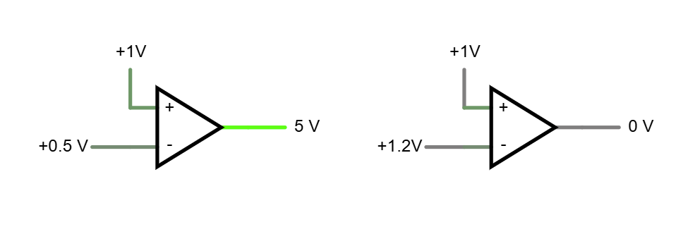

# Otázka 19 - A/D a D/A převodníky

## Slovo úvodem

A/D a D/A převodníky, jak již název napovídá, převádí analogové hodnoty signálů na digitální a naopak. Toho dosáhnou dvěmi základními funkce - **diskretizací** a **kvantováním**.
- **Diskretizace** znamená převod signálu ze spojitého do diskrétního, tj. "rozsekaného" na časové vzorky (např. každou 1ms). Je to stejný rozdíl jako mezi vektorovou a rastrovou grafikou - křivky jsou spojité, bitmapa ne. 
- **Kvantování** znamená převod spojitého rozsahu hodnot na diskrétní množinu, tj. "zaokrouhlení" na nejbližší hodnotu z měřícího rozsahu převodníku (např. 10-bit ADC v Arduinu UNO má rozsah 0-1023, takže krokujeme cca po 5mV).

Když tahle pravidla aplikujeme $(A\rightarrow D)$, můžeme nějakou dobu signál zaznamenávat a následně ho v PC dále zpracovat - pokusit se dokreslit chybějící části mezi body, odhadnout původní tvar signálu, nebo použít algorytmy pro zpracování signálu (filtry, Fourierova transformace, atd.).

Pokud na to jdeme opačně $(D\rightarrow A)$, můžeme z digitálních dat vytvořit analogový signál, který se nám převede do spojitého (ne, diskrétní v přírodě nenajdeme). O spojení těchto bodů se starají různé filtry a to už chtěné či nechtěné (RC/RL filtry, ale i parazitní vlastnosti vedení atp.). Proč myslíte, že zvuk z telefonů zněl tak špatně? A proč vytáčené připojení bylo tak pomalé? To už ale moc odbočuji.

> Pro jednoduchost zde budu dodržovat nap. úrovně "klasické" TTL logiky, tj:
> - log. 0: 0V (validní 0-0,4V)
> - log. 1: 5V (validní 2,1-5V)
> - Provozní napětí: 5V
> - Zakázané pásmo: 0,4-2,1V (kdy může dojít k nejednoznačnému chování)
>
> Samozřejmě existují i jiné úrovně, např. 3,3V logika, 1,8V, pro CMOS se používalo i 12V, atd. Ovšem čím nižší napětí, tím menší spotřeba, rychlejší přepínání apod. 

## A/D převodníky

První částí základu kažého převodníku je komparátor, který dělá jedinou věc - porovnává. Porovnává vstupní napětí s nějakou referencí a říká nám, jestli je vyšší (log. 0) nebo nižší (log. 1). 

### 

Teď dokážeme zjistit, zda-li je vstupní signál větší než 1V. Tak jich přidáme více. A trochu interaktivněji.

<iframe
	src="https://www.falstad.com/circuit/circuitjs.html?ctz=CQAgjCAMB0l3BWEAWB0DsZnMwZgEwBsAHAJySkgKRUq5UCmAtGGAFACG4Y+46hIfJGJ8BlJDTDx44aCOThpkNgCVuvMIRrFJWqPuQ0FNE9ARsA5uAH58CzYMP7lAeUHDRghALD9w4NjchEXxvLxswiHY1Vl47bRp45xQaehMoM051cPcQsPF9KSVZEXoi+CzYlAdg6rFaSSVJOX9yuFVswwSU9KNJZJhzII9kGrDRnwDh0twIgVxZ1o6qgm7V5KdeXsyuFcXahfqJRWKwFo0lNgB3FBEwUg0ecAeoa9vn3mQQ9C23r8Eftl8IDlDd-sDPqUEL8wVDHrxcNDXrCQIjIXQYe9kAROjjlL50fcth99OgSg1nGYQAA1AD2ABsAC4cCwMNiGei4SD2bAgH5GPHuAD6hGQQsgQp4+HIQrQ8FwxGQpFI6CVyuV4tgcDAQpYIqFQiFuCN4qFYolUlNpHFbCAA"
	width="100%"
	height="380"
	title="Více komparátorů - Falstad"
	loading="lazy"
	style="border: 1px solid #ddd; border-radius: 8px;"
></iframe>

Nyní máme funkční převod z analogového signálu na 4-bitový digitální výstup, který ofšem není binární. Máme 4 převody, 4 výstupy, 4 úrovně. Pokud bychom taková data četli nějakým počítačem, dokážeme je již na bin. hodnotu převést, ale to za nás může udělat i hardware. V další ukázce jsem přida převoník 1z7 na 3-bit binární výstup (nejedná se o multiplexer, ale o převodník. Multiplexer podle bin vstupu vybírá 1zN vstupů a pouští jej na výstup, např. [CD4052](https://www.ti.com/lit/ds/symlink/cd4052b.pdf)). Také jsem v následující ukázce zapojení obrátil (koukněte na operační zesilovače), což efektivně udělalo negaci jejich výstupu

<iframe
    src="https://www.falstad.com/circuit/circuitjs.html?ctz=DwYwlgTgBAZgvAIgIwKgFwM6IAwDpsEECsqYIiALEbgOxIUV0DMATAGwAcAnNl6iACNERbKgAOQhBSaoAbhGGoAtpmEBTALRIUAPgBQUKMABKUAB6JtLKEjbYoHe7dGwcqAO7wELpQEMzspQIAPT6hsAA5uaWbFAsLBQ2sQkuXqKhBkYA8tFSrDY0sRSOBWyoXihQGOTIIWHZudLWLNgcUMX2LRzllqjVvRnhphbISM0U9iUpPd4eacr+gQgyg0bDlmPtBA72E6luUJ4HfgED9cA5I01xE+1TEzOV-bWrJrlWUKyT9l8zLkezKAnJYsOqZYDuRptJBcawfGGg1yzV6Qq7Q2F3OI0RHzFFQrFwzYsbF-MHhVGUNrE6zFT5EHFuPFoumE6xMemkpmUlmYpqc84UqRta4fPlI9LnABqvggxl8YAANviEVAnLDSYcvDRygoECxcDIgYtFFU0IhJQB7BVoXwRNRkowAZRAFrEalyRE2zigsOFxVJ9XCFqgagAdpYSFUxIg2BQZmYWthEdGEFoEIHDEYxFAli5niRVpmsznEIbnnhCChC5ngNm1IhEbm+jUCxnwnXS3IDvmHUXayGY13AT3q8BghbzsFna61OcQAqlFBQ0pEAATNQwXwAV2tGrA4YQABEaAAaQ9sM9EM8UM9MM8sM+VC2IACKD5fSBPL5cYAqFpgNDoMGABCACSABy6ZIAA-LBcFwNoSB6NBMFwdBCFINgyEoWhCHYEhcGoehmFYWhqFwPhBFkeh+GkWhKEUfheiECxjHYGO85KHOSojEwTCxEghSfBwiSCWU4rKM+CDrpuO5oA6wC+O8XpCV0pQzN0RomkoYAHBEviWCxErgoKaliQS6kSVyeqtHERDJLcLD2fyJm5CkdkOT82BxlZApubcTDeZ8-GfN5Lnkm52IWXxyQkr5rkjNSFlJWJ4VGKZtkxcFsQxWlEJubZFC2KFiRFeJuJ+bxQVlSVnycHlgqBYk-FtFlLV5UpIwfE5yS2T1GkLNpumAvphksQpnUbGyIVqblSKaX4Q16QZyBGRNyk0sVallQNWkIJGOnLWNhBghxkD6EAA"
    width="100%"
    height="380"
    title="Více komparátorů s kodérem - Falstad"
    loading="lazy"
    style="border: 1px solid #ddd; border-radius: 8px;">
</iframe>

> Pokud chcete, můžete si převodník dostavět Jakou binární hodnotu mají výstupy Qn?

Jako poslední už potřebujeme pouze 2 úpravy:

1. 4 napěťové reference znamenají 4 přesné stabilizátory s odrušením pro každou úroveň. Lepší použít jeden stabilizátor a druhou základní část každého A/D či D/A převodníku - **dělič napětí**. Ten můžeme zapojit buď na referenční úrovně, nebo na vstupní signál. V obou případech nám zajistí přesné úrovně pro porovnávání.

> Jak se liší vstupní parametry A/D převodníku s děličem napětí na vstupu aa na referenčních úrovních? A k čemu by mohl být dělič napětí na ref. úrovních náchylný?

2. Kvantizaci na 4 úrovně jsme již provedli, ale stále nám chybí diskretizace. Co kdybychom postavili 16-bit převodník, ale mohli číst jen 8-bit hodnoty? Museli bychom číst po polovinách, což ale znamená časovou prodlevu mezi daty, kde může v signálu dojít ke změně. A nebo potřebujeme číst v přesný časový okamžik, zatímco CPU dělá něco jiného. 

    V takovém případě nám pomůže nějaký vzorkovací obvod, který si celou hodnotu v jeden okamžik uloží a my ji pak můžeme číst klidně i později. Zde nám stačí i obyčejný registr.

<iframe
    src="https://www.falstad.com/circuit/circuitjs.html?ctz=CQAgjCAMB0l3BWEAWB0DsZnMwZgEwBsAHAJySkgKRUq5UCmAtGGAFADmIxNyP3vUoShQ2AdxTFwpfODCywM0RL7TZq-OlmRxkkJoXz9W5XoN7cCbbtWXDsu6dtW9yAk6lv7da2BOrFbTURdH1oKSQaKOgkADUAewAbABcAQw4GNgBCEAATBgAzVIBXFJEAEXQAGnLCGoQa5BrcGvwaiABFNo6wKo6aMHiC9AAdAGdk+PGAIQBJADlwAH4V1ZGAR1YwEYA7JbBVlY3WSF2Vg7XNyG2988uwODPVi43rm8P9pdeHp8Pt9bgN3gwNejx2bHwkCkuFwwj8wlwxGQ4HQwho+SKpWSIkibFScgUqP0UJRwgiIgewN4YSklPgukhtKJ5nhpkZ+gQwnwyBo+E5bJ5HK5gtwkGROgk5nMMK5JglxOhsJAMuVSvlLOZJnM6pFYtVCL16pJyDAsvUprZ-gt0pIloctpVsKkOnxrFkfK5JI93FoAypvOgpCDwZDoZp4CpeIJ+oVMfJfqp4EDoZTwfo+HCEeBUbdKGtxot8azwKgydTKdCGdpkdNEWw4HrhG5DeR6l9InlXlJVHrrM77nZCHr7P77sFQ9bgp0AHkQIRBaySEy4eA2LP57ySUvYxB2OvBdyaNvD+BV2NJLyTBPjG2IEVEmMGCAAMoAQViAFE2AAlC83lDzv+UQoDQkQdjEbAAE4COAhA0PwJ4Jjo0EIYK-AEMBdJQTBGEwTymH0ihvBwHh-BIdh-CmvB1EUvSEiUXB0ZUaYqEDEYiG6OhkLRrh8r8Ph0YCTov78KJR7iiI44dqWCBsEAA"
    width="100%"
    height="380"
    title="Celý A/D převodník - Falstad"
    loading="lazy"
    style="border: 1px solid #ddd; border-radius: 8px;">
</iframe>
