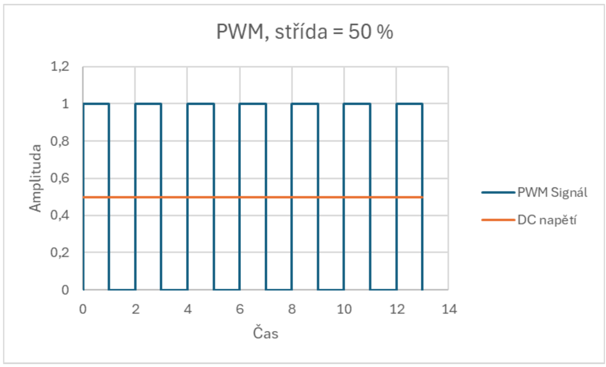
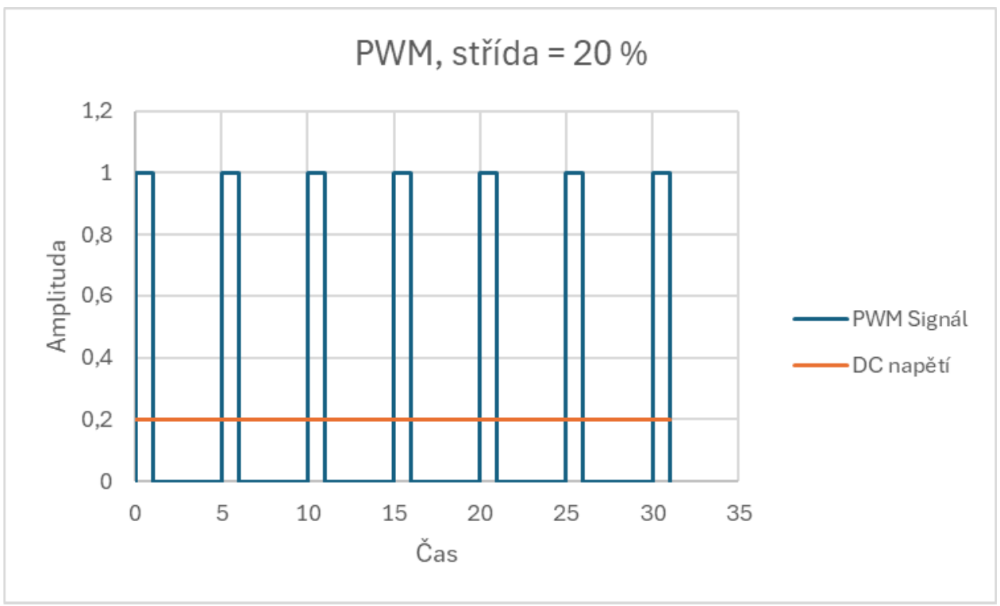

# Otázka 20 - Pulzně šířková modulace (PWM)

Pulzně šířková modulace (PWM) je technika používaná k imitaci analogového signálu pomocí digitálního výstupu. Signál rychle přepíná mezi vysokou a nízkou úrovní a poměr $T_{ON}/T_{OFF}$ (střída) určuje efektivní hodnotu výstupního signálu. Pak už spoléháme na vyhlazení výstupu buď vlastním zařízením (např. setrvačností motoru), filtrací nebo že výsledné "blikání" nebude pro danou aplikaci vadit (např. u LED diod blikáme mnohokrát rychleji než lidské oko postřehne).

Nyní ale přejděme rovnou k příkladu, na kterém si princip vysvětlíme:

<iframe
	src="https://www.falstad.com/circuit/circuitjs.html?ctz=DwYwlgTgBAZgvAIgIwKgFwM6IAwDpsEECsqYIiAzABy4BsAnLQCzNFNIBMT9SSTqIAEaIi2VAAdhCJhVQA3CCNQBbTCICmAWl4IAfACgoUYAHcoAD0TbaUTlVs27qeAjEB6A0dMWrSR7WwHBzFYHAQPQ2MzSwRrKEYgxmcwiK9o3xtmIOZk13DPKJ9kJiYoLKQAdkz+ULzU42UAV3MivzLSpnsc2pCMdUQOfMjQNGgY7U52qE0s7pcQwTBEGrAAO0QYAEMAGz6VAHsUguAAGSKOCo4oCg5Aji5r29z3Y7OYi6uOKnt70q+qZ5DLxvAaXKAcIg2X7gyGAqDiRAoeqnc5g6HorhwhHIIHGABKRU0FGwpTamhkVz8uSpUBMLkGsEUyACIWUm3McgGuBIUEWmywCA43Nx3hiTAIUCogRK9ilgOR6WkEr4HU6thK8uOio+j0CxNK+s1w21aO+1xJ4MuRrSqM+kPNf3F1sK7zRD314OwAJ6IpNlICDtsVWdotBlK+gZVIb98RsHt4DPmvttUw9cp9yJA22UUFWymWmkWaCgIH2ynEmwgmzQ+wgcLWiAAghQADRQRscNuNpBd7BtgBCrag-c7w57w5ChwQjYAZJtywBubZoBf9rtwNftmcAcxX-dILiYhbAxdL5cr1drekb-YAwgARdt3x9wKDYJDYfRIAD8v7fv+-KBXwIJB9G7P9G2wP9gPfMD+x-J8oKAt9YJvW8kCfW9Ahg0CAMAvDkI-bBgDcLNlGOLMijTPVaFlEIkygZQpyPIsSzLCsqxrOtM1GVoqimaE5jCXklmkUh1gQLZdnUA5hLkDglCgOQiCUBVCQTKYJiuJIMy1QkPTVIkKBsTpo304yoEMigLKQehEyOY19ItWyriJC12FoMzxgMtpKhMmkk2REFkH4igiE+d1wqxRFkxiDToQ0sL7LqPS4smJKgzjKLdMcmIpXBB58uoGpAtePi4yoP53Uq6KcTUvK9UqzLrhqnLgXKyy2mhDzaqRMrXSuGUCtVb1SuGABJJzSTs6Z404OEMG2HBhSgAALUSSHqqx4xmozHDskNgrc0p8vJG5JXohybTFNUNI82x5ral1ll8yZ7ohTynuASabp+e0hr8haltcFb1tU1Kw0stV7plLyXpM6GuthL7FXe-61Q+uGEGYQI7CgCobK+XJBmRRtVgAEymx5phcx4QzJynvItBJtBmnSxq8BmiiGhJIUCdmruMLnfuCKA+eCLGtOpqWhJS3LEBx2N2lxomUaKRW8Y1gIQ0Z3wZvOqWbjhJjEHJ9QtkaZcRV12JaZZjSBbyRipzNi2reRG3xYSRXHdZF3zc2S20Gtopxb8QItcup2TYQV3A-d44AGVS3EdRufy6EqnsClAQKLx9igdQJJYVAMGxWXzFkeFfD0SIjC8cQlOEjByAQTa8-r4BG85BAq5b5bCGwegqkhCFcS8Nx9mONxk-2VODBI8AIAMIA"
	width="100%"
    height="380"
    title="Více komparátorů s kodérem - Falstad"
    loading="lazy"
    style="border: 1px solid #ddd; border-radius: 8px;">
</iframe>

Jak si lze všimnout, výstupní signál v pravidelných intervalech přepíná mezi log. 0 a log. 1. Veškeré nastavení je ovládáno řídícím registrem (umístěn uprostřed pod čítačem).

### Řídící registr

| Bit 7 | Bit 6 | Bit 5 | Bit 4 | Bit 3 | Bit 2 | Bit 1 | Bit 0 |
|------|------|------|------|------|------|------|------|
| Střída | Střída | Střída | Střída | Vstupní | dělič | Volba vstupu | Polarita výstupu |

- Střída (Duty Cycle) - 4 bity - nastavení $T_{ON}/T_{OFF}$
- Vstupní dělič - 2 bity - nastavení frekvence (dělící poměr vstupního signálu)
- Volba vstupu - 1 bit - výběr mezi hodinovým signálem či externím vstupem
- Polarita výstupu - 1 bit - hw prohození $T_{ON}/T_{OFF}$.


---

Původní text dále

---


# Princip funkce
- funguje na principu rychlého spínání a vypínání signálu, přičemž se mění poměr mezi dobou zapnutí a vypnutí (střída)
- umožňuje regulaci systémů řízených analogovým vstupem (DC motory, LED), k plynulosti je však potřeba dostatečně vysoká frekvence (např. u LEDky by mohlo být viditelné jak bliká)
- (pro pochopení) pokud je střída 50 %, pak se námi spínaný systém chová jako kdyby byl spínán stejnosměrným napětím poloviční amplitudy (adekvátně pak pro střídu 33.3 % je DC napětí třetinové amplitudy, ...).



---

# Klíčové parametry
- **Frekvence** - počet cyklů za sekundu
- **Střída (Duty Cycle)** - poměr doby zapnutí k celkové periodě
- **Rozlišení** - počet kroků pro nastavení střídy

---

# Využití PWM
- Řízení rychlosti motorů
- Regulace jasu LED diod
- Řízení topných těles
- Audio zesilovače třídy D

---

# Příklad implementace pro Pico
```python
# Nastavení PWM na ESP32 s MicroPythonem
from machine import Pin, PWM
import time

# Vytvoření PWM objektu na pinu 2
pwm = PWM(Pin(2))

# Nastavení frekvence na 1000 Hz
pwm.freq(1000)

# Hlavní smyčka
while True:
	# PWM s 50% střídou (32767 je polovina z 65535)
	pwm.duty_u16(32767)
	time.sleep(1)
```
PWM signál na pinu 2 s 50% střídou a frekvencí 1000 Hz.

---

# Použití PWM
**Servo** má el. desku, které PWM signál přijme a změří jeho signál v čase.
- Pro polohovací serva (omezená šířka polohy většinou 180 °) tento signál znamená úhel natočení servomotoru
	- například pro ovládání robotických ramen

- U kontinuálního serva (servo co se točí dokola) signál PWM znamená rychlost a směr otáčení.
	- například jak rychle nebo pomalu se bude točit kolo u autíčka nebo ventilátor

**LED dioda** - u LED diody můžeme pomocí PWM řídit jas diody

> Ilustrační obrázek serva v původních podkladech chybí, proto je zde ponechaný jen textový popis.


