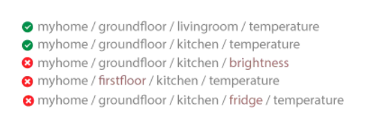

# Otázka 21

## Komunikační protokol MQTT a jeho využití

- správce: Jirka
- stav: převedeno z archivu do nové stránky
- původní zdroj: [21. Komunikační protokol MQTT a jeho využití](../archiv/skripta-kyb/kybernetika/chapters/21.%20Komunikační%20protokol%20MQTT%20a%20jeho%20využití.md)

---

# MQTT
- Návrhový vzor **publisher/subscriber**
- Broker (centrální bod) třídí zprávy podle témata (topic) a zařízení buď:
	- **Publikuje** v daném tématu (publisher) a odesílá zprávu brokeru, který ukládá a přeposílá **zprávu** zařízením, které mají **odběr** (subscribtion) na dané téma
	- Je **přihlášeno k odběru** na dané téma a broker zasílá tomuto zařízení všechny **zprávy** daného **téma**
- V protokolu se posílají **zprávy** ( **Message** nebo také **Payload** ) a s ní téma ( **Topic** )
- Klient může publikovat i v topicu, u kterého má subscribe. Zpráva se samozřejmě odešle **všem subscriberům**, takže i klientovi, který publikoval. Irl se to ale takto nedělá. Nejlépe se klient změní ze subscribera na publishera, zprávu pošle a poté se vrátí na stav subscribera.
- Témata
	- místo kam “putujeˮ zpráva
	- Jedno zařízení může mít **odběr nebo publisher** u **více témat najednou**. Zpráva může patřit **právě do jednoho tématu**
	- **Publisher nemusí zakládat nové téma**. Pokud broker přijme zprávu s novým tématem automaticky jej založí
	- Témata jsou řetězce **UTF8** (diakritika není problém)
- **Wildcards**:
	- **Single level** = “+ˮ
		- odběr celé **jedné úrovně** témat
		- pokud odbíráme téma: `myhome/groundfloor/+/temperature`


- **Multi level** = “#ˮ
	- odběr **všech úrovní** témat
	- pokud odbíráme téma: `myhome/groundfloor/#`


- Normálně broker **nevidí strukturu** topicu (topic je prostě string, Broker nevidí závorky jako oddělovače úrovně)
- Když broker **detekuje wildcard** , rozdělí si zprávu podle lomítek a vytvoří si routovací tabulku, podle které zasílá nové zprávy subscriberům
- Protokol je “payload agnosticˮ = **formát** dat / zpráv je **irelevantní** (nejčastěji JSON nebo BSON). Obsah zprávy je omezen na **256 MB**.

## QoS
Tři úrovně **QoS** (Quality of Service). Klient **nemusí všechny podporovat**
**= Potvrzení o dodání** zprávy / packetu
1. Zpráva je odeslána bez potvrzení a **není zaručeno doručení**
2. Zpráva je doručena **alespoň jednou**
3. Každá zpráva je doručena **právě jednou**

## Struktura MQTT


Ukázka programu MQTT v Micropythonu:
```python
import network
import time
from machine import Pin
from umqtt.simple import MQTTClient

wlan = network.WLAN(network.STA_IF)
wlan.active(True)
wlan.connect("ssid","pass")
time.sleep(5)
print(wlan.isconnected())

sensor = Pin(16, Pin.IN)

mqtt_server = 'broker.hivemq.com'
client_id = 'sauron'
topic_pub = b'middle_earth/sauron'
topic_sub = b'middle_earth/sauron'
topic_msg = b'Ach nach utunbagul'
```

```python
def callback(topic, msg):
	print("Message received: ", msg)
	print("Topic: ", topic)
```

```python
def mqtt_connect():
	client = MQTTClient(client_id, mqtt_server, keepalive=3600) #keepalive oz
	client.connect()
	print('Connected to %s MQTT Broker'%(mqtt_server))
	return client
```
Parametr “**keepalive**ˮ označuje interval v sekundách, během kterého musí odesílatel odeslat packet `PINGREQ` aby nebylo připojení ukončeno. Broker po přijetí odpovídá `PINGRESP` packet, který potvrzuje že je připojení pořád aktivní

```python
def reconnect():
	print('Failed to connect to the MQTT Broker. Reconnecting...')
	time.sleep(5)
	machine.reset()

try:
	client = mqtt_connect()
	client.set_callback(callback)
	client.subscribe(topic_sub) #zaregistruje schránku, kterou poslouchá a
except OSError as e:
	reconnect()
while True:
	client.publish(topic_pub, topic_msg) #topic_pub = jméno schránky
	#topic_msg = odesílané data
	time.sleep(3)
```


