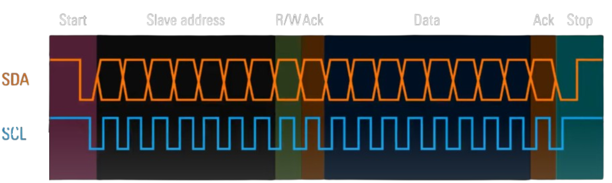
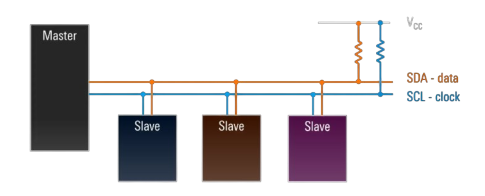
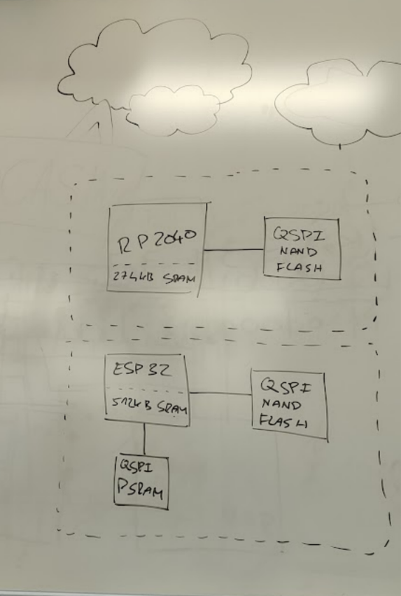
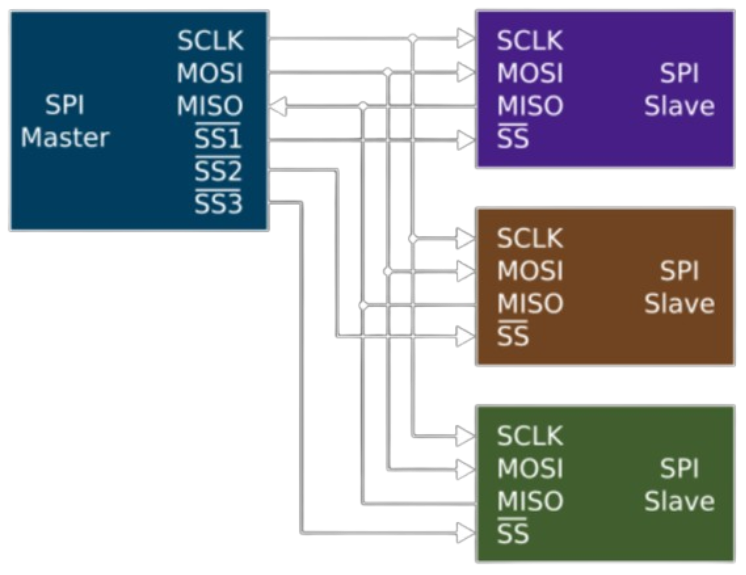
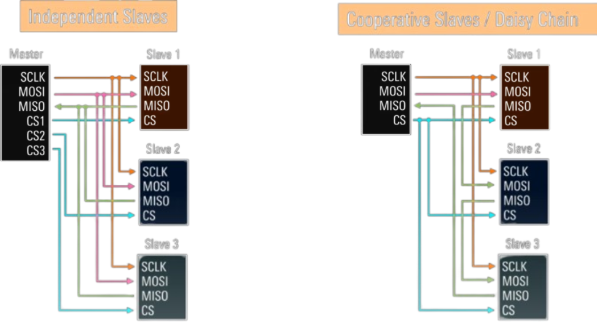
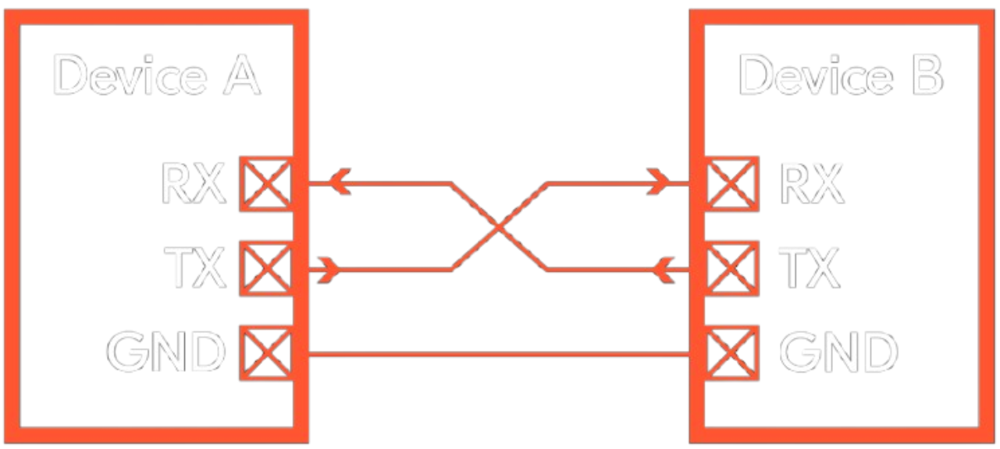

# Otázka 22 - Komunikační sběrnice I2C a SPI

## Slovo úvodem

Digitální komunikace (teď myslím tu drátovou) může probíhat dvěma způsoby - paraleleně a sériově.

- Paralelní přesnos informací přenese veškeré bity v jeden čas, což nám dovolí vysoké přenosové rychlosti (třeba u RAM v počítačích). Nevýhodou je potřeba vodiče pro každý bit a krátkého vedení (kvůli rušení a parazitním vlastnostem přenosové cesty).

- Sériový přenos posílá data jeden bit za druhým za cenu času. To ušetří dráty, komunikace se jednodušeji chrání před rušením (a lze využít různých triků jako je např. difirenciální signálování) a hlavně lze datové bloky škálovat dle potřeby (např. přidat více/méně paritních bitů, ...).

## I2C

I2C je jednoduchý sériový protokol pro komunikaci mezi integrovanými obvody. Byl vyvinut firmou Philips (nyní spadá pod NXP) a hodí se pro připojení různých senzorů apod. kde není třeba velkého datového toku. Je **synchronní**, s **master-slave** architekturou.

Na lince můžeme mít (teoreticky) až 127 zařízení, každé s unikátní 7-bitovou adresou.

### Start komunikace (Start Condition)
- **Master zařízení** iniciuje komunikaci.
- Na **SDA** (Serial DAta) lince nastavíme log. 0 a současně **SCL** (Serial CLock) linka zůstává na log. 1.
- Pak Master začne generovat hod. signál a pošle první byte - 7-bit adresu cílového zařízení + 1 bit pro určení směru dat (0 pro zápis, 1 pro čtení).

> Čtení dat probíhá vždy s náběžnou hranou CLK (log. 0 → log. 1)

### Klíčové vlastnosti I2C
- **Synchronní komunikace:**
	- **SCL** linka určuje časování přenosu, což zajišťuje správnou synchronizaci mezi zařízeními.
- **Half-duplex přenos:**
	- Data mohou proudit pouze jedním směrem v daném okamžiku. Pokud chceme po zápisu číst, musíme kom. ukončit a initovat znovu s novým nastavením.
- **8-bitová slova**
	- Data jsou přenášena v blocích po 8 bitech. Po každém bytu následuje ACK (acknowledge) bit od cílového zařízení potvrzující přijetí dat.
- **Rychlosti přenosu:**
	- Standardní režim: 100 kbps
	- Fast mode: 400 kbps
	- Fast mode plus: 1 Mbps
	- High-speed mode: 3.4 Mbps
	> Samozřejmě jen jednosměrně (viz výše), přepínání R/W průměrnou rychlost dost omezí. Vyssí rychlosti jsou také náchylnější k rušení a parizitním jevům na vedení.

- **Princip otevřeného kolektoru a pull-up rezistory**
	- I2C používá otevřený kolektor (open-drain) pro SDA a SCL, což znamená, že zařízení mohou pouze "táhnout" linku na log. 0. Pro udržení log. 1 jsou potřeba pull-up rezistory. To zabraňuje potenciálním problémům, kde by se jedno zařízení snažilo vysílat log. 1, zatímco jiné by se snažilo vysílat log. 0.

- **Nediferenciální přenos**
	- Po SDA a SCL linkách jdou odlišné signály a vodiče se lehce ruší navzájem. To je problematicé právě při delších vedeních a vyšších přenosových rychlostech (mag. pole způsobené jedním vodičem indukuje napětí do druhého a opačně), proto je **teoretická max. vzdálenost cca 2m**. Při nízkých rychlostech a s kvalitním stíněním lze dosáhnout cca na 10m maximálně.

### Topologie I2C

### Dodatky

- Data se přenášejí pouze při náběžné hraně hodinového signálu (kdy CLK dosáhne logické jedničky).
- Běžný rámec přenosu zahrnuje:
	- **1. byte obsahující r/w bit a adresu.**
	- Pokud má zařízení přístup k registru s adresami, může si adresu změnit podle potřeby. Samozřejmě pouze když neprobíhá komunikace.
- Po obdržení adresy zařízení odpovídá stažením linky na logickou 0 (ACK - acknowledge), zatímco ostatní zařízení zůstanou neaktivní.
- Následuje samotný přenos dat – například:
	- Zařízení se dotáže na hodnotu registru na adrese 7 (na adrese registru v zařízení) a obdrží odpověď s obsahem této pozice.
- Po každé úspěšné zprávě zasílá přijímající zařízení ACK (stažení linky na logickou 0) jako potvrzení přenosu.

## SPI

SPI (Serial Peripheral Interface) je sériový komunikační protokol, implementující synchronní, plně duplexní komunikaci mezi zařízeními. Vyvinula jej firma Motorola v 80. letech.

Na rozdíl od I2C není třeba posílat adresní byte. Adresa je nahrazena dedikovaným CS/SS (Chip Select / Slave Select) signálem pro každé zařízení. D9ky tomu po datových linkách posíláme již jen samotná data. 

_Poznámka:_ SPI jde také využít pro zvýšení přenosové rychlosti a efektivní propojení s paměťovými zařízeními. Důležité je při návrhu určit správnou polaritu hodinového signálu.

## Základní principy komunikace
### Zapojení vodičů
- **SS (Slave Select) / CS (Chip Select):**
	- Vybírá konkrétní zařízení pro komunikaci. Většinově se používá aktivní log. 0 ($\overline{SS}$)
- **SCK (Serial ClocK):**
	- Hodinový signál generovaný master zařízením.
- **Přenosové linky:**
	- **MOSI (Master Out, Slave In):** Datová linka Master → Slave, také ozn. jako TX na master zař. a RX na slave zař.
	- **MISO (Master In, Slave Out):** Datová linka Slave → Master, také ozn. jako RX na master zař. a TX na slave zař.

### Postup komunikace
1. **Výběr zařízení:**
	Master nastaví linku SS/CS na logickou 0 pro zařízení, se kterým chce komunikovat.
2. **Generování hodin:**
	Master začíná vysílat hodinový signál na SCK.
3. **Současný přenos dat:**
	Data jsou posílána prostřednictvím MOSI a MISO simultánně.
4. **Ukončení komunikace:**
	Po přenosu master zastaví generování hodinového signálu a linku SS/CS vrátí na logickou 1, čímž ukončí komunikaci.

## Výhody SPI
- Velmi jednoduchá implementace.
- Efektivní pro komunikaci s periferními zařízeními, která vyžadují vyšší rychlosti přenosu.
- Nízké nároky na počet pinů – vhodné pro vestavěné systémy a zařízení s omezeným počtem dostupných GPIO.
- Možnost přidat více MISO/MOSI linek pro zvýšení přenosové rychlosti (např. Quad SPI).

---

# UART
## Základní popis
UART (Universal Asynchronous Receiver/Transmitter) je hardware, který umožňuje **asynchronní sériovou komunikaci** mezi zařízeními. Na rozdíl od protokolů jako I2C či SPI nevyžaduje externí hodinový signál pro synchronizaci přenosu.

## Klíčové vlastnosti
- **Asynchronní sériový přenos:**
	Data jsou přenášena po bitech bez potřeby synchronizačního hodinového signálu.
- **Formát zprávy:**
	Přenos dat probíhá v rámci specifikovaného formátu, kde:
	- **START bit** signalizuje začátek přenosu.
	- **DATA bity** obsahují informace (často začínající prvním bytem, který může obsahovat např. informaci o počtu následujících bitů).
	- **STOP bit** značí konec přenosu.
- Je důležité poznamenat, že na jedné sběrnici nemohou být aktivní více UART zařízení současně, aby nedošlo ke kolizím.

