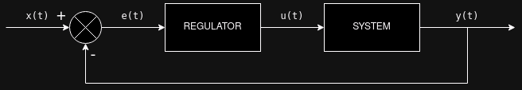
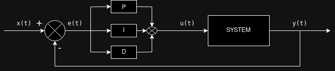

# Otázka 23 - Regulátory - P, PI, PID

## Princip řízení pomocí zpětné vazby

Schéma systému zapojeného ve zpětné vazbě s regulátorem, kde:

-$x(t)$je požadovaná hodnota výstupu.
-$e(t)$je chyba, tedy rozdíl výstupu a vstupu ($e(t) = y(t) - x(t)$)
-$u(t)$je řídící veličina. Hodnota generovaná regulátorem, která je přivedená na vstup systému.
-$y(t)$je výstup systému.

## P-Regulátor (Proporcionální regulátor):

### 1. **Diferenciální rovnice (Proporcionální regulátor)**:
Proporcionální regulátor se řídí jednoduchým vztahem mezi vstupní chybou a regulačním signálem. Regulátor generuje regulační akci, která je úměrná okamžité hodnotě chyby.

$u(t) = K_P \cdot e(t)$
Kde:
-$u(t)$je výstup regulátoru (regulační akce),
-$K_P$je proporcionální zisk (zesílení) - nastavuje sílu reakce regulátoru,
-$e(t)$je chyba systému ($e(t) = \text{žádaná hodnota} - \text{skutečná hodnota}$).

### 2. **Přenosová funkce (Proporcionální regulátor)**:
Přenosová funkce popisuje vztah mezi vstupem a výstupem systému v Laplaceově doméně:

$G(s) = K_P$

### 3. **Vysvětlení**:
Proporcionální regulátor reaguje na chybu v systému tím, že aplikuje sílu, která je úměrná velikosti chyby. Čím větší je chyba, tím větší je regulační akce. Proporcionální regulátor může způsobit zbytkovou chybu v ustáleném stavu, protože nikdy úplně neeliminuje chybu., pokud není nulová.

---

## I-Regulátor (Integrační regulátor):

### 1. **Diferenciální rovnice (Integrační regulátor)**:
Integrační regulátor vytváří výstup, který závisí na integrálu chyby. Výstup se neustále zvyšuje nebo snižuje v závislosti na tom, zda je chyba kladná nebo záporná. Integrační složka pomáhá eliminovat zbytkovou chybu v ustáleném stavu.

$u(t) = K_I \int_{0}^{t} e(\tau) \, d\tau$

Kde:
-$K_I$je integrační zisk (zesílení),
-$\int_{0}^{t} e(\tau) \, d\tau$je integrál chyby v čase.

### 2. **Přenosová funkce (Integrační regulátor)**:
Přenosová funkce pro integrační regulátor:

$G(s) = \frac{K_I}{s}$

### 3. **Vysvětlení**:
Integrační regulátor se zaměřuje na akumulaci chyby v průběhu času. Jeho hlavní funkcí je eliminace zbytkové chyby, která by mohla zůstat po použití pouze proporcionálního regulátoru. Pokud je chyba kladná, integrační akce zvyšuje výstup, dokud není chyba nulová. Při špatném nastavení může I-regulátor způsobit „nabalování“ (wind-up), což vede k pomalé reakci nebo přestřelení.

> Numericky I regulátor můžeme implementovat jako jako jednoduchou sumu chyb s pevným časovým krokem:
>$u(t) = u(t-1) + K_I \cdot e(t) \cdot \Delta t$
> kde$u(t-1)$je předchozí výstup regulátoru,$e(t)$je aktuální chyba a$\Delta t$je časový krok mezi dvěma měřeními.

---

## D-Regulátor (Derivační regulátor):

### 1. **Diferenciální rovnice (Derivační regulátor)**:
Derivační regulátor vytváří výstup, který závisí na rychlosti změny chyby. Čím rychleji se chyba mění, tím silnější je regulační akce.

$u(t) = K_D \cdot \frac{d}{dt} \cdot e(t)$

Kde:
-$K_D$je derivační zisk (zesílení),
-$\frac{d}{dt} \cdot e(t)$je časová derivace chyby.

### 2. **Přenosová funkce (Derivační regulátor)**:
Přenosová funkce pro derivační regulátor:

$G(s) = K_D \cdot s$

### 3. **Vysvětlení**:
Derivační regulátor reaguje na rychlost změny chyby. Pokud se chyba rychle zvyšuje nebo snižuje, derivační regulátor poskytne silnou regulační akci k vyrovnání změny. Jeho hlavní funkcí je tlumení oscilací a zlepšení stability systému. Derivační regulátor je velmi citlivý na šum, protože jakékoli rychlé změny v chybě mohou způsobit velké výstupní akce.

## PID regulátor:

PID je navržen pro regulaci hodnot procesů, například teploty, rychlosti, tlaku nebo polohy. PID je zkratka pro Proporcionální (P), Integrální (I) a Derivační (D) složky regulátoru. Každá z těchto složek přináší určité vlastnosti do regulace a společně tvoří efektivní nástroj pro udržení regulovaného procesu na požadované hodnotě.

Výstup PID regulátoru lze vypočítat:

$u(t) = K_p \cdot e(t) + K_i \int e(t) \,dt + K_d \frac{de(t)}{dt}$,

kde:

-$e(t) = y(t) - x(t)$: chyba = výstup systému - požadovaný vstup

-$K_p$,$K_i$,$K_d$, jsou konstanty složek (proporcionální, integrační, derivační)

V Laplaceově přenosu:

$G(s) = K_p + \frac{K_i}{s} + K_d \cdot s$

## Metody nastavování PID regulátoru:

- Manuální ladění: Nastavení PID parametrů lze provádět experimentálně, kdy se postupně zvyšuje$Kp$​, dokud nedosáhneme dobré odezvy, pak se přidá$Ki$​, a nakonec$Kd​$.

> Nemá smysl volit$K_P$vyšší, než systém zvládne. Příklad: pokud při ohřevu s největší chybou (často při startu) regulátor nastavuje téměř plný výkon, nemá smysl volit vyšší$K_P$. Systém to nezvládne a akorát by vyšší$K_P$způsobilo větší překmit a nestabilitu.

> Po hrubém nastavení$K_P$pak přidáme$K_I$​ a postupně doladíme odchylku v ustáleném stavu. Nakonec přidáme$K_D$​ pro zlepšení stability a snížení překmitů. Zároveň je dobré vyzkoušet rychlost odezvy na změny.

- Ziegler-Nichols metoda: Jedna z nejčastějších metod pro ladění PID parametrů, která využívá oscilace systému při daných hodnotách PID parametrů.

> Ne každý systém je pro Z-N metodu vhodný. Některé systémy mohou být velmi stabilní a vybudit je k oscilacím může být obtížné nebo nebezpečné.

> Do Z-N metody se propisuje také chování budiče ve fyzickém zařízení, který může mít omezení výkonu, ale také způsobovat další nestabilitu, která s rozkmitáním může pomoci.

> Obecně platí, že čím lepší je model celé smyčky, tím lépe lze regulátor naladit.

- Automatické ladění: Některé systémy mají automatické algoritmy pro nastavení PID parametrů, které sledují chování systému a přizpůsobují parametry v reálném čase.

Existují i další metody.

Zde je zrevidovaný a doplněný učební materiál. Upravil jsem matematický zápis podle standardů, doplnil jsem klíčovou informaci o cílovém útlumu a přidal požadovaný praktický příklad s hotendem 3D tiskárny.

***

### Ziegler-Nicholsova metoda

Ziegler-Nicholsova metoda je klasická a široce používaná metoda pro ladění parametrů PID regulátorů. Tato metoda byla vyvinuta J. G. Zieglerem a N. B. Nicholsem ve 40. letech 20. století a je založena na experimentálním přístupu, kdy se regulátor nastavuje přímo na reálném systému, aby se dosáhlo požadované dynamické odezvy.

Hlavním historickým cílem této metody je dosáhnout tzv. **čtvrtinového útlumu** (poměr amplitud 25 %). To znamená, že každá následující vlna oscilace má čtvrtinovou amplitudu oproti vlně předchozí, což zajišťuje rychlý návrat k žádané hodnotě, i když za cenu počátečních překmitů.

Ziegler-Nicholsova metoda existuje ve dvou základních variantách:
- **Metoda periodických oscilací** (také známá jako "closed-loop" metoda nebo metoda kritických kmitů),
- **Metoda reakční křivky** (také známá jako "open-loop" metoda, používá se tam, kde by umělé vyvolání oscilací bylo nebezpečné nebo příliš pomalé).

#### Příklad: Metoda periodických oscilací (Closed-loop)

Tato metoda se používá v uzavřené smyčce. Postup je následující:

1. Nastavte regulátor tak, že vypnete integrální a derivační složky (tj. $K_i = 0$ a $K_d = 0$) a postupně zvyšujte proporcionální zesílení $K_p$, dokud systém nezačne trvale kmitat s konstantní amplitudou. Tento bod je známý jako kritické zesílení $K_u$(ultimate gain).
2. Změřte periodu oscilací $T_u$ (ultimate period), což je doba trvání jednoho celého cyklu oscilace (např. od vrcholu k vrcholu).
3. Vypočítejte parametry $K_p$, $K_i$ a $K_d$ podle následující tabulky:

| Typ regulátoru | $K_p$ | $T_i$ | $T_d$ | $K_i$ | $K_d$ |
|---|---|---|---|---|---|
| **P** | $0.5 K_u$ | – | – | – | – |
| **PI** | $0.45 K_u$ | $0.83 T_u$ | – | $0.54 K_u / T_u$ | – |
| **PID** (klasický) | $0.6 K_u$ | $0.5 T_u$ | $0.125 T_u$ | $1.2 K_u / T_u$ | $0.075 K_u T_u$ |

*(Poznámka: Tabulka ukazuje jak časové konstanty $T_i, T_d$, tak přímo vypočtená zesílení $K_i, K_d$ pro standardní nezávislý tvar PID regulátoru).*

#### Vlastnosti a omezení Z-N metody
1. **Agresivní reakce**: Metoda nastavuje parametry tak, aby zajistila rychlou odezvu. To vede k vysoké citlivosti, ale často také k nezanedbatelným překmitům.
2. **Hranice stability**: Výsledné nastavení tvoří systém sice stabilní, ale s relativně nízkou bezpečnostní rezervou. Pokud se změní provozní podmínky (zátěž), může se systém rozkmitat.
3. **Nutnost dolaďování**: V praxi slouží Z-N metoda často jen k nalezení výchozích hodnot. Pro procesy, kde je překmit nepřijatelný, je nutné po primárním výpočtu snížit proporcionální složku nebo prodloužit integrační čas.
4. **Podmínka kmitů**: Pro Z-N metodu je klíčové, aby systém byl schopen kmitat. Některé systémy jsou příliš stabilní a kmitání nelze vyvolat nebo je téměř neznatelné.

---

### Praktický příklad: Ladění hotendu 3D tiskárny

Při 3D tisku je nutné udržovat přesnou teplotu trysky (hotendu), například 200 °C. Mnoho tiskáren používá vestavěnou funkci "PID autotune" (často G-code příkaz `M303`), která dělá na pozadí přesně Ziegler-Nicholsovu metodu. Jak by to vypadalo manuálně?

1. **Vypnutí I a D složky**: V nastavení tiskárny byste nastavili $K_i = 0$ a $K_d = 0$.
2. **Hledání kritického zesílení ($K_u$)**: Postupně byste zvyšovali$K_p$. Zjistíte, že např. při$K_p = 15$začne teplota neustále pravidelně kmitat mezi 195 °C a 205 °C, aniž by se kmity utlumovaly nebo zvětšovaly. Zapíšete si **$K_u = 15$**.
3. **Měření periody ($T_u$)**: Změříte čas s pomocí stopek nebo grafu. Zjistíte, že teplota dosáhne vrcholu 205 °C přesně každých 40 sekund. Zapíšete si **$T_u = 40$** vteřin.
4. **Výpočet klasického PID**:
   - Proporcionální složka:$K_p = 0.6 \cdot 15 = 9$
   - Integrační složka:$K_i = 1.2 \cdot 15 / 40 = 0.45$
   - Derivační složka:$K_d = 0.075 \cdot 15 \cdot 40 = 45$

**Výsledek a praxe na tiskárně:**
Zadáte do EEPROM tiskárny hodnoty$K_p = 9$,$K_i = 0.45$,$K_d = 45$. Při zahřívání z pokojové teploty hotend velmi rychle dosáhne 200 °C. Protože je Z-N metoda agresivní, teplota pravděpodobně krátce přesáhne cíl (např. na 203 °C - tzv. překmit), ale derivace ($K_d$) tento překmit rychle utlumí a integrál ($K_i$) následně srovná teplotu přesně na 200 °C. Ve chvíli, kdy do trysky narazí studený filament a strhne teplotu dolů, regulátor okamžitě zareaguje a přidá výkon topného tělíska.
