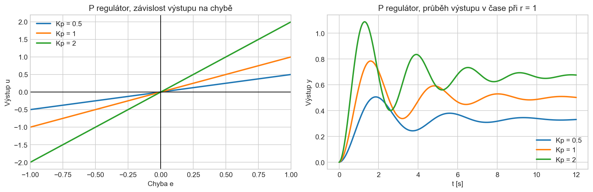
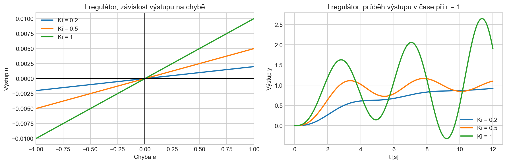
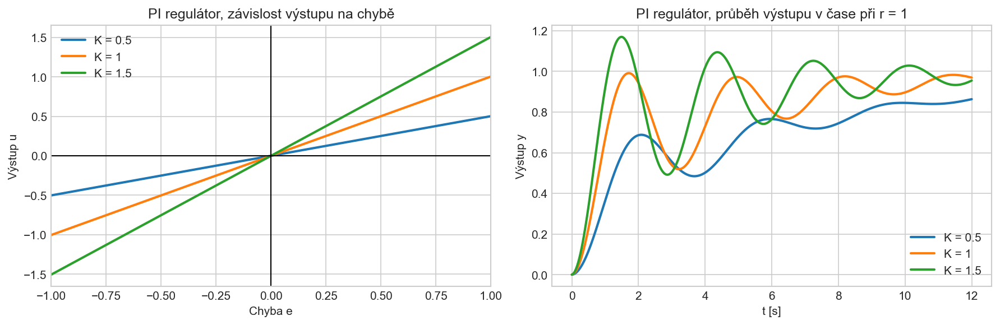
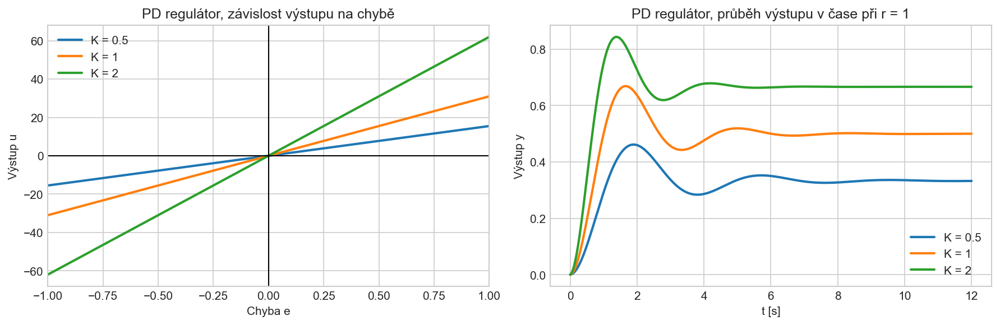
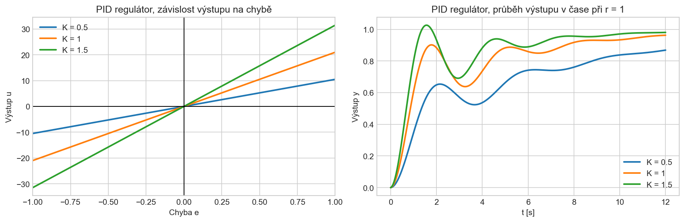
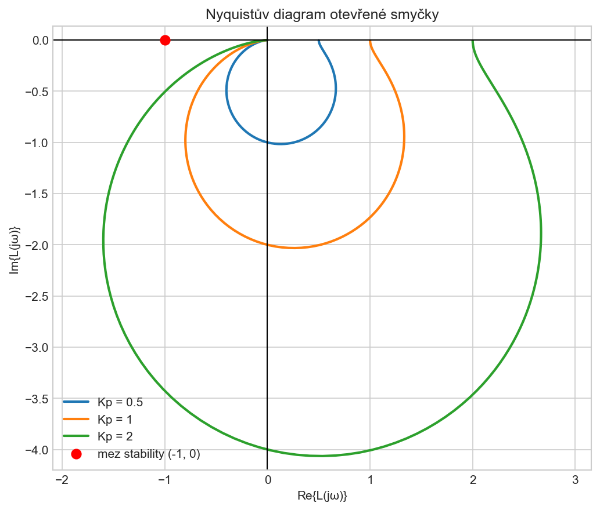
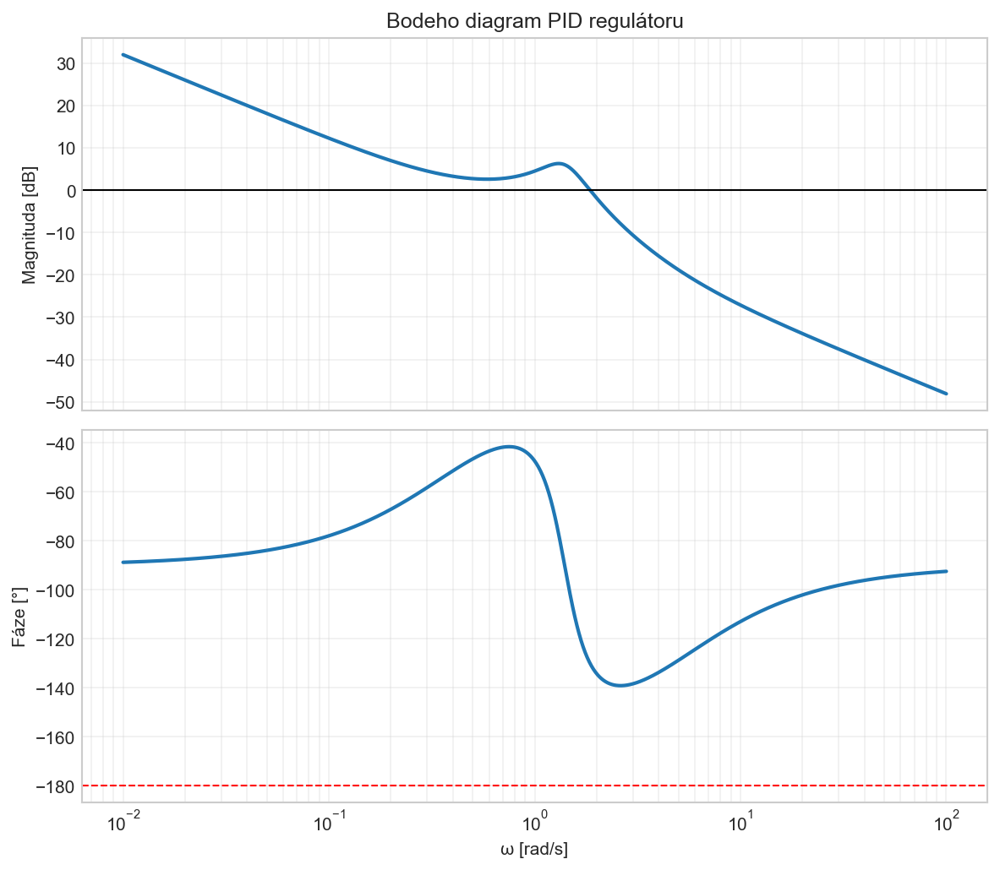

# Otázka 24 - Návrh a stabilita regulátorů

> Vytvořeno pomocí Gemini 3.1 Pro (reasoning:high). Skripty: GPT-5.4 mini

Regulátory v uzavřené zpětnovazební smyčce reagují na regulační odchylku (rozdíl mezi žádanou a skutečnou hodnotou) a generují akční zásah, aby odchylku minimalizovaly.

> Model použitý pro ilustrace: Podtlumený systém 2. řádu s přirozenou frekvencí $\omega_n = 1.4$ rad/s a tlumením $\zeta = 0.25$. Jde o zjednodušenou analogii tepelné soustavy s výraznější setrvačností, například hotendu 3D tiskárny.

### 1. Základní typy regulátorů a jejich použití

*   **P regulátor (Proporcionální):** Reaguje na *přítomnost* (aktuální velikost chyby). Je rychlý a jednoduchý, ale trpí **trvalou regulační odchylkou** (nikdy nedosáhne přesně cíle). Vhodný pro podřadné systémy (plovákový ventil). Nevhodný pro přesné řízení.
*   **I regulátor (Integrační):** Reaguje na *minulost* (sčítá chybu v čase). Zcela eliminuje trvalou odchylku, ale je pomalý a vnáší do systému zpoždění, které zhoršuje stabilitu. Samostatně se téměř nepoužívá.
*   **PI regulátor:** Univerzální dříč průmyslu. Rychlý (díky P) a přesný (díky I). Vhodný pro řízení průtoku, tlaku čerpadel či otáček. Nevhodný tam, kde je kritické zabránit jakýmkoliv překmitům.
*   **PD regulátor:** Reaguje na *budoucnost* (rychlost změny chyby). Působí jako tlumič oscilací. Neumí odstranit trvalou odchylku a extrémně zesiluje zašuměné signály. Vhodný pro rychlá serva a polohování.
*   **PID regulátor:** Komplexní řešení. Pokud je správně naladěn, poskytuje rychlou, přesnou odezvu bez překmitů a bez trvalé chyby. Vhodný pro složité dynamické systémy s velkou setrvačností (tepelné soustavy, jako je hotend 3D tiskárny, stabilizace dronů).

#### Ukázkové grafy regulátorů

P regulátor:

I regulátor:

PI regulátor:

PD regulátor:

PID regulátor:

---

### 2. Nyquistovo kritérium: Chůze po ostří nože (Walking on a razor's edge)

Při propojování regulátoru a procesu nechceme riskovat havárii (zapojit systém a čekat, zda se rozkmitá). Nyquistovo kritérium nám umožňuje bezpečně předpovědět stabilitu **uzavřené smyčky** pouze z toho, jak se systém chová v **otevřené smyčce** (když do něj pošleme testovací vlnění a sledujeme odezvu). Zkoumáme tzv. frekvenční odezvu.

#### Co znamená „frekvence“ ve fyzikálním světě?
V řídicí technice neznamená frekvence rádiové vlny, ale **jak rychle a periodicky měníme akční zásah** (vstup do systému). Z vnějšího světa to simuluje překážky (pomalá změna = průvan v místnosti; rychlá změna = náraz studeného filamentu do trysky).

#### Příklad na hotendu 3D tiskárny:
Představme si, že odpojíme regulátor a topíme do trysky manuálně otáčením kolečka výkonu (0 až 100 %) jako sinusoidou. Teploměr ukazuje odezvu systému (zesílení teploty a její zpoždění).

1.  **Nízká frekvence (velmi pomalý pohyb):** Výkonem točíme nahoru a dolů tak, že jeden cyklus trvá 10 minut. Hliníkový blok teplotu bez problému stíhá a kopíruje ji od 20 °C do 250 °C. *Amplituda vlny (zesílení) je obrovská, fázové zpoždění téměř nulové.*
2.  **Extrémně vysoká frekvence (bleskový pohyb):** Přepínáme výkon 10krát za sekundu (10 Hz). Kovový blok se nestihne ohřát ani ochladit, teplota se ustálí na určité hodnotě jako rovná čára. *Zesílení klesne na nulu (princip PWM regulace).*
3.  **Kritická frekvence (bod zlomu):** Začneme točit kolečkem s cyklem například 40 vteřin. Tepelná setrvačnost bloku způsobí obrovské zpoždění signálu. Teplota doroste do maxima *přesně ve chvíli, kdy my už máme výkon vypnutý na nule*. Vlna teploty je vůči vlně výkonu **zpožděná přesně o polovinu cyklu (fázový posun -180°)**.

Tento třetí bod je hledané magické místo. Záporná zpětná vazba regulátoru říká: „Když je teplota vysoká, stáhni topení“. Kvůli 180° setrvačnému zpoždění ale regulátor začne naplno topit přesně ve chvíli, kdy to nepotřebujeme, čímž systém rozkmitá.

#### Mez stability (-1, 0j)
Pokud v místě, kde se u systému fáze zpozdí o -180°, je navíc vlna na výstupu stejně velká jako na vstupu (**Zesílení = 1**), systém se zacyklí do trvalých oscilací.

Této souřadnici matematicky říkáme **mez stability**, bod $(-1, 0j)$. Naladit regulátor tak, aby proces proťal přesně tento bod, je obrazná **„chůze po ostří nože“**. Systém trvale kmitá a stačí nepatrný impuls k tomu, aby se zřítil do nestability (zesilující se kmity a pád) nebo se utlumil do bezpečí. 

**Nyquistovo pravidlo:** Otevřený obvod je obvykle pod naší kontrolou stabilní. Pokud vyneseme závislost jeho amplitudy a fáze do grafu, uzavřený obvod bude stabilní právě tehdy, pokud tato křivka chování **neobepne onen kritický bod -1 (mez stability)**.

#### Nyquistův diagram a Bodeho charakteristika

Jak číst Nyquistův diagram a je systém stabilní?
Když se podíváte na Nyquistův diagram uvedený výše, hledáte jedinou věc: pozici kritického bodu $(-1, 0j)$ vůči nakreslené křivce.

Je zobrazený systém stabilní? Ano, je. Vidíme, že zakreslená křivka frekvenční odezvy tento kritický bod neobepíná (bod leží bezpečně vlevo mimo uzavřenou smyčku samotné křivky). To znamená, že jakmile systém fyzicky uzavřeme zpětnou vazbou, kmity se utlumí a proces bude stabilní.
Lze jej dostat do nestabilní polohy? Rozhodně. Představte si, že v regulátoru ztrojnásobíte proporcionální zesílení ($K_p$). Celá Nyquistova křivka se v grafu „nafoukne“ třikrát do šířky. Část křivky, která protíná osu X, by se posunula směrem doleva, překročila by bod $-1$ a obepnula by jej. V tu chvíli by amplitudová bezpečnost (GM) klesla pod nulu a systém by v praxi naprosto nekontrolovatelně zhavaroval. Stejně tak přidání zpoždění (např. delší trubky u ventilu) by křivku fázově pootočilo po směru hodinových ručiček, což by ji také mohlo natlačit na náš „břit nože“.
Kořeny systému: Skrytá DNA stability
Aby inženýři nemuseli stabilitu jen odhadovat z křivek, počítají vlastnosti systému pomocí tzv. kořenů (nebo pólů). Můžete si je představit jako matematickou „DNA“, která přesně definuje, jak se systém zachová, když jej vychýlíme z rovnováhy. Kořeny se vykreslují do 2D grafu (komplexní roviny), protože se skládají ze dvou složek: reálné a imaginární.

1. Reálná část (poloha na ose X) – Určuje PŘEŽITÍ (Stabilitu)
Tato složka rozhoduje o tom, zda amplituda vln roste nebo klesá.

Záporná hodnota (levá polorovina): Systém se postupně uklidňuje (vlna se tlumí postupně k nule). Čím dále vlevo kořen leží, tím rychleji tlumení proběhne. (Stabilní chování)
Kladná hodnota (pravá polorovina): Systém se po vychýlení začne rozkmitávat s čím dál větší amplitudou, dokud nehavaruje. (Nestabilní chování)
Nulová hodnota (leží přesně na středové ose Y): Vlny se ani netlumí, ani nerostou. Systém trvale kmitá a balancuje na mezi stability.
2. Imaginární část (poloha na ose Y) – Určuje KMITÁNÍ (Frekvenci)
Tato složka neovlivňuje, zda systém přežije nebo havaruje, ale říká nám, jakým stylem se bude chovat.

Nenulová hodnota: Znamená, že odezva má periodický (vlnovitý) charakter. Čím je kořen na ose Y dál od nuly, tím rychleji systém kmitá (má vyšší frekvenci).
Nulová hodnota (leží přímo na ose X): Imaginární část chybí. To znamená, že systém vůbec neudělá „vlnu“ (nemá překmit). Pouze pozvolna po křivce „dojede“ do cíle (nebo od cíle uteče, pokud je reálná část kladná). Jedná se o tzv. aperiodický pohyb.
Zlaté pravidlo stability:
Aby byl řízený systém stabilní, všechny jeho kořeny bez výjimky se musí nacházet v levé polorovině (musí mít zápornou reálnou část). Bez ohledu na to, jak úžasných je 9 kořenů, stačí jeden jediný kořen, který „přeteče“ do kladné (pravé) poloroviny, a celý systém skončí nestabilitou.

#### Měření bezpečné vzdálenosti od ostří
V praxi navrhujeme systémy tak, aby měly dostatečný odstup od nestability. Sledujeme dvě míry bezpečnosti:

1.  **Amplitudová bezpečnost (Gain Margin - GM):** Pokud dojde k fázovému posunu -180°, jak moc je v tu chvíli křivka utlumená? Určuje, kolikrát můžeme matematicky zvětšit zásah regulátoru, než narazíme na Zesílení 1 ($GM = 1 / |G|$). V praxi požadujeme obvykle alespoň > 6 dB.
2.  **Fázová bezpečnost (Phase Margin - PM):** Ve chvíli, kdy má systém zrovna plné přímé zesílení rovno 1, o kolik stupňů u něj ještě chybí fázové zpoždění do kritických -180°? Dobře navržený PID regulátor by měl mít fázovou bezpečnost **mezi 45° a 60°**. To zajistí, že systém bude dynamický a rychlý, ale neudělá žádné zbytečně velké překmity.

## Zdroje

- MSTAR LABS. Z-N-C rules for tuning PID controllers [online]. [cit. 2026-05-16]. Dostupné z: [https://www.mstarlabs.com/control/znrule.html](https://www.mstarlabs.com/control/znrule.html)
-  Ziegler, J.G & Nichols, N. B. (1942). "[Optimum settings for automatic controllers](https://web.archive.org/web/20170918055307/http://staff.guilan.ac.ir/staff/users/chaibakhsh/fckeditor_repo/file/documents/Optimum%20Settings%20for%20Automatic%20Controllers%20(Ziegler%20and%20Nichols,%201942).pdf)" (PDF). Transactions of the ASME. 64: 759–768. Archived from the [original](http://staff.guilan.ac.ir/staff/users/chaibakhsh/fckeditor_repo/file/documents/Optimum%20Settings%20for%20Automatic%20Controllers%20(Ziegler%20and%20Nichols,%201942).pdf) (PDF) on 2017-09-18.
- WIKIPEDIA. Ziegler–Nichols method [online]. [cit. 2026-05-16]. Dostupné z: [https://en.wikipedia.org/wiki/Ziegler%E2%80%93Nichols_method](https://en.wikipedia.org/wiki/Ziegler%E2%80%93Nichols_method)