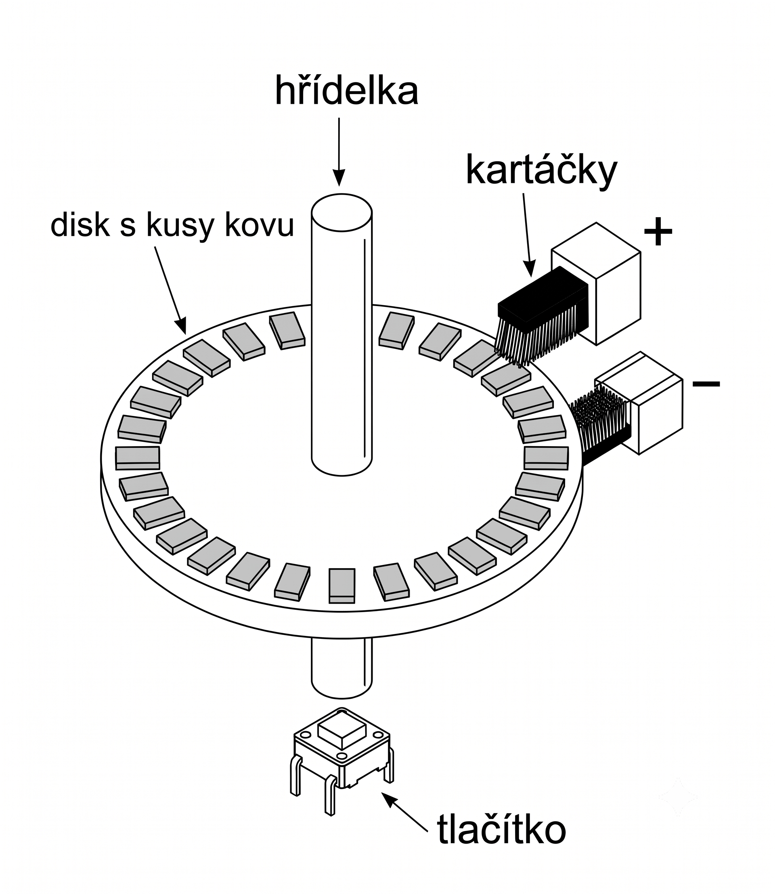
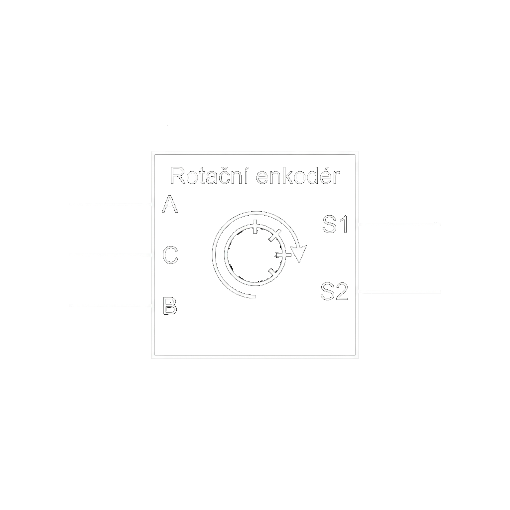

# Enkódery

## Princip fungování
- **elektromechanický nebo elektronický převodník**
- transformuje rotační pohyb hřídele na digitální nebo analogový signál
- pomocí řídicího mikrokontroléru lze odvodit absolutní nebo relativní úhel otočení, rychlost a směr pohybu
- absolutní úhel natočení $\alpha$ u inkrementálního typu:
  $$ \alpha = \frac{360^\circ}{N} \cdot C $$
  - $\mathbf{N}$ = celkové rozlišení enkodéru (počet pulzů na otáčku)
  - $\mathbf{C}$ = aktuální stav čítače pulzů

## Rozdělení enkodérů podle typu výstupu
- **Inkrementální snímače**
  - generují pouze informaci o relativní změně polohy (pulzy během pohybu)
  - výpočetní systém musí tyto pulzy sčítat
  - po ztrátě napájení systém nezná polohu, dokud se hřídel nezkalibruje (na referenční bod)
- **Absolutní snímače**
  - každá úhlová pozice má unikátní digitální kód (často **Grayův kód**)
  - po připojení napájení systém okamžitě zná přesnou úhlovou polohu bez nutnosti pohybu

## Rozdělení podle fyzikálního principu snímání
### 1. Mechanické (Kontaktní)
- nejrozšířenější typ pro běžná uživatelská rozhraní (např. modul `KY-040`)
- rotující disk má vodivé segmenty, po kterých kloužou stacionární sběrače (kartáčky)
- cyklické propojování a rozpojování kontaktů vytváří **dva obdélníkové signály posunuté o 90°** (kvadraturní signál)
- **výhody:** nákladově velmi efektivní
- **nevýhody:** mechanické opotřebení, zákmity kontaktů (bouncing) $\rightarrow$ vyžaduje softwarovou či hardwarovou filtraci

*(Obrázek: Řez mechanickým inkrementálním enkodérem se stacionárními kartáčky a spodním tlačítkem osy)*

### 2. Optické
- snímání probíhá zcela bezkontaktně
- disk se štěrbinami periodicky přerušuje světelný paprsek mezi **LED diodou a fototranzistorem**
- **výhody:** extrémně vysoké rozlišení, absence mechanických zákmitů
- **nevýhody:** citlivé na prach a nečistoty v prostředí

### 3. Magnetické
- hřídel rotuje s permanentním diametrálně magnetizovaným magnetem
- magnetické pole je bezkontaktně snímáno soustavou **Hallových sond**
- **výhody:** vysoce odolné vůči prachu, kapalinám a opotřebení $\rightarrow$ průmyslový a automotive standard

## Konfigurace vývodů (Pinout běžných modulů)

- standardní moduly mechanických inkrementálních enkodérů (s integrovaným spínačem) disponují pěti vývody:
  - **CLK (Kanál A):** primární výstupní signál, detekce hran přes přerušení (interrupt)
  - **DT (Kanál B):** sekundární výstupní signál, určuje směr rotace vyhodnocením stavu při přerušení kanálu A
  - **SW (Switch):** výstup osového spínače (tlačítka), vyžaduje aktivaci pull-up rezistoru
  - **+ / VCC:** napájení (typicky $3.3\,\mathrm{V}$ nebo $5\,\mathrm{V}$)
  - **GND:** referenční zem ($0\,\mathrm{V}$)

## Interaktivní model systému
- ukázka generování kvadraturního signálu a reakce řídicího mikrokontroléru:
  

## Aplikace v kybernetice a průmyslu
- **Mechatronika a CNC systémy:** zpětnovazební odměřování polohy u servomotorů a rotačních kloubů manipulátorů (typicky optické/magnetické absolutní)
- **HMI (Human-Machine Interface):** spolehlivé ovládací prvky měřicí techniky a panelů vyžadující krokovou odezvu (typicky mechanické inkrementální)
- **Průmyslová automatizace:** snímání ujeté vzdálenosti (odometrie) a přesná regulace rychlosti pohybu transportních systémů
