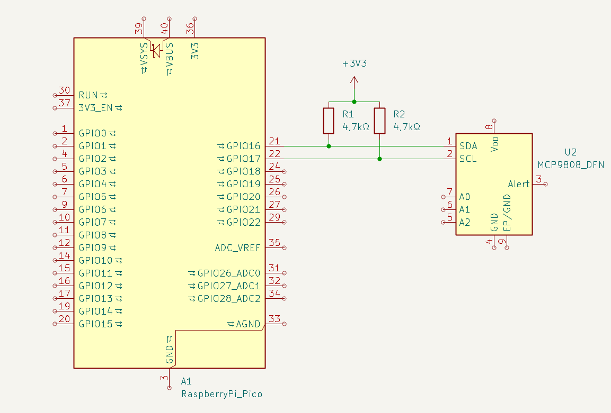

# I²C protokol
I2C (Inter-Integrated Circuit) je dvouvodičová sériová sběrnice o linkách SDA (data) a SCL (hodiny). Linky jsou typu open-drain/open-collector — zařízení mohou linku táhnout na LOW, HIGH je zajištěno pomocí pull-up rezistorů.

## Historie a kontext
- I2C byl vyvinut firmou Philips (nyní NXP) v 80. letech jako jednoduché dvouvodičové řešení pro komunikaci mezi čipy na jedné PCB (např. procesory, EEPROM, ADC, RTC). Hlavní cíle byly jednoduchost, nízké náklady a možnost připojit více zařízení bez složitého rozhraní.

## Pravidla zapojení a komunikace
- **Open-drain & pull-up**: fyzicky nepřipojujeme linku přímo na HIGH — používáme pull-up rezistory. To umožňuje více zařízením bezpečně sdílet linku.
- **Kapacita vedení & časové konstanty**: vztah mezi pull-up rezistorem R a kapacitou C určuje časovou konstantu $\tau = R\cdot C$; pomalé stoupání linky omezuje maximální taktovací frekvenci. S delšími vodiči nebo větší kapacitou snížíme rychlost nebo hodnotu pull-up.
- **Arbitráž**: pokud více masterů vysílá současně, arbitráž probíhá bit po bitu — ten, kdo očekává 1, ale čte 0, přestane vysílat a tím prohraje arbitráž.
- **Clock stretching**: slave může držet SCL LOW, čímž přinutí master čekat; můžeme to použít, pokud slave potřebuje více času na zpracování.
- **Adresování a signály**: běžně používáme 7-bit adresy (0–127), sekvenci START/STOP, adresní bajt a ACK/NACK po každém bajtu; existuje i 10-bit režim.

## Stručný přehled
**Role**:
- **master** generuje takt (SCL) a inicializuje komunikaci
- **slave** reaguje na adresu. 
I²C podporuje více masterů (arbitráž) a více slave zařízení.

**Signály**: 
- START
- STOP 
- adresní bajt (adresa + R/W) 
- ACK/NACK

### Vysvětlivky a alternativní názvy
- **I²C / I2C / IIC**: různé zápisy téhož protokolu (technicky přesný tvar je `I²C`).
- **TWI (Two-Wire Interface)**: alternativní název, často v dokumentaci AVR/Atmel.
- **Adresování — 7-bit vs 8-bit**: běžně se udává 7-bit adresa (0–127). Někdy se používá 8-bitový zápis, kde je k 7-bit adrese přidán R/W bit (např. 7-bit `0x3C` → 8-bit `0x78` pro zápis, `0x79` pro čtení).
- **Formáty adres**: hex (`0x3C`), binárně (`0b00111100`) nebo dekadicky (`60`). Příklad: 7-bit `0x3C` = dec `60` = bin `0b00111100`.
- **SDA / SCL**: datová a hodinová linka; některé desky mají více I2C busů označených `SDA0/SCL0`, `SDA1/SCL1` apod.
- **ACK / NACK, START / STOP, repeated START**: zkrácené názvy pro potvrzení/odmítnutí a řízení přenosu.
- **Open-drain / open-collector**: termíny popisující fyzické zapojení výstupů.
- **10-bit addressing**: rozšířený režim adresování umožňující více než 128 adres pomocí speciální prefixní sekvence adresních bajtů; méně běžné, používá speciální adresní formát.
- **clock stretching**: technika, kdy slave drží SCL LOW, aby zpomalil master a získal čas pro vnitřní zpracování nebo pomalejší periferní operace.
- **arbitration / bus arbitration**: proces, při kterém si více masterů vzájemně soutěží o řízení sběrnice; ten, kdo detekuje nesoulad na lince, přestane vysílat a přijde o řízení.
- **level shifter**: obvod (nebo modul) pro překlad napěťových úrovní mezi sběrnicemi (např. mezi 3.3V a 5V zařízeními), často realizován pasivními obvody pro open-drain linky.
- **Příklady běžných I2C čipů (zkratky)**: `PCA9555` (I/O expander), `AT24C02` (EEPROM), `PCA9600` (level shifter).

## Rychlosti
- Standard mode: 100 kHz
- Fast mode: 400 kHz
- Fast-mode Plus: 1 MHz
- High-speed mode: 3.4 MHz
- Ultra-fast mode: až 5 MHz (méně běžné, unidirectional)

Rychlost se nastavuje na masteru jako frekvence SCL v konfiguraci I2C řadiče. V MicroPythonu ji typicky nastavíme parametrem `freq`, například `freq=100000` pro standard mode nebo `freq=400000` pro fast mode.

Poznámka: reálná rychlost závisí na kapacitě sběrnice, hodnotě pull-up rezistorů a délce vedení.

V praxi to znamená, že pro vyšší rychlosti musíme zkrátit vedení, snížit kapacitu sběrnice a zvolit menší pull-up rezistory, aby stihl signál na SCL/SDA dostatečně rychle naběhnout.

## Dosah a omezení
- Dosah omezen kapacitou vedení a rušením; typicky desítky centimetrů až několik metrů při nízkých rychlostech.
- Pro delší vzdálenosti je lepší použít I2C buffers/line drivers nebo převod na diferenciální pár (např. RS-485 nebo LVDS) a zpět.
- Pro spolehlivost užíváme kratší vodiče, kvalitní zemní spojení, správné pull-up (např. 4.7k při 3.3V) a případně sériové rezistory blízko pinů.

## Zapojení
- Spojíme SDA ↔ SDA, SCL ↔ SCL a sdílíme společné GND; VCC připojíme pokud zařízení používají stejný napájecí rail.
- Použijeme pull-up rezistory na SDA a SCL na VCC (typicky 4.7k při 3.3V; pro jiné napájeí hladiny tabulka níže).
- Pokud jsou na sběrnici vícero pull-up rezistorů (na modulech), zkontrolujeme výslednou paralelní hodnotu.



Na obrázku můžeme vidět zapojení tepelného senzoru k raspberry pi pico.

### Nejčastější napájecí úrovně a pull-up rezistory

| Napájení sběrnice | Typický pull-up | Poznámka |
|---|---:|---|
| 1.2 V | 2.2 kΩ až 10 kΩ | Používá se hlavně u moderních nízkonapěťových čipů; volíme spíše nižší odpor pro jistější náběh. |
| 1.8 V | 2.2 kΩ až 4.7 kΩ | Časté u logiky s nižší spotřebou; při delším vedení volíme menší odpor. |
| 2.5 V | 2.2 kΩ až 4.7 kΩ | Kompromis mezi spotřebou a rychlostí náběhu. |
| 3.3 V | 4.7 kΩ, případně 2.2 kΩ až 10 kΩ | Nejběžnější varianta v hobby i embedded světě; 4.7 kΩ bývá dobrý výchozí bod. |
| 5.0 V | 4.7 kΩ až 10 kΩ | Používá se u starších nebo některých průmyslových zařízení; vždy ověřujeme kompatibilitu vstupů. |

Poznámka: čím vyšší je kapacita sběrnice nebo čím vyšší rychlost používáme, tím spíše volíme menší odpor pull-up rezistorů.

## Role zařízení na sběrnici
**Master** je zařízení, které komunikaci řídí. Zahajuje přenos, posílá START, adresu a pak podle potřeby zapisuje nebo čte data. V praxi jím bývá například mikrokontrolér, vývojová deska jako ESP32, Raspberry Pi Pico nebo Arduino, případně hlavní procesor v zařízení nebo řídicí jednotka.

**Slave** je zařízení, které na požadavek masteru odpovídá. Jakmile pozná svou adresu, potvrdí ji ACK a pokračuje přenosem dat. Typicky jde o teplotní nebo tlakový senzor, EEPROM paměť, RTC hodiny, displej, převodník ADC/DAC nebo I/O expandér.
___
*Poznámka: na jedné sběrnici může být více slave zařízení a v některých případech i více masterů; o to, kdo právě řídí sběrnici, se stará arbitráž. V praxi je master režim v MicroPythonu běžně dostupný, ale slave režim bývá omezený nebo vyžaduje speciální knihovnu či upravený firmware.*

## MicroPython — ukázky

### Master (praktické příklady pro ESP32 / RP2040)

```python
from machine import I2C, Pin

# Příklad: ESP32 (piny se liší podle desky)
i2c = I2C(0, scl=Pin(22), sda=Pin(21), freq=400000)

# Scan — najde zařízení na sběrnici
devices = i2c.scan()
print('I2C devices:', devices)

# Zápis dat na device s adresou 0x3C
addr = 0x3C
i2c.writeto(addr, b'\x00\xA5')

# Čtení N bajtů
data = i2c.readfrom(addr, 4)
print(data)

# Běžný pattern: zapsat adresu registru, pak číst
reg = 0x10
i2c.writeto(addr, bytes([reg]))
val = i2c.readfrom(addr, 1)
print(val)
```

- Doporučení: použijeme `freq=100000` pro standard mode, `400000` pro fast. Na RP2040 obvykle `I2C(1, scl=Pin(15), sda=Pin(14))`.

### Slave (poznámky a doporučení)

> Standardní `machine.I2C` v MicroPythonu často neposkytuje jednoduché, univerzální API pro I2C slave. Implementace závisí na portu a konkrétní desce.

- Použijeme komunitní knihovnu, například `i2cslave` pro RP2040 nebo PIO-based implementace.
- Napíšeme softwarový (bit-banged) slave, ale ten bývá nespolehlivý při vyšších rychlostech.
- Upravíme firmware v C, pokud potřebujeme plnou HW podporu slave režimu.

Ilustrativní (pseudokód, závisí na konkrétní knihovně):

```python
# Příklad pouze jako ilustrace — závisí na externí knihovně
from i2cslave import I2CSlave

slave = I2CSlave(sda_pin=14, scl_pin=15, addr=0x42)

while True:
    ev = slave.poll()
    if ev and ev.type == 'write':
        data = ev.data
        # zpracujeme přijatá data
        slave.reply(b'OK')
```

## Závěr
- Shrnutí a praktické tipy: používáme vhodné pull-up rezistory, minimalizujeme délku vedení; pro delší vzdálenosti použijeme převodníky nebo buffery.

Můžeme doplnit ukázky přímo pro konkrétní desku (ESP32, Raspberry Pi Pico/RP2040, ESP8266).

### Vysvětlení pro laiky (analogicky)
- Představme si I2C jako společnou poštovní schránku se dvěma linkami — jedna pro „kdy posílat" (hodiny), druhá pro poštu (data). Master je jako pošťák, který klepe (START), řekne adresu domu (adresní bajt) a buď vloží dopis (zapisuje), nebo vybere dopis (čte). Pull-up rezistory jsou jako pružiny, které vracejí víko schránky nahoru — nikdo schránku „neodpaluje nahoru", pouze ji stahuje dolů, když chce poslat signál.

### Časté problémy a jejich řešení
- Linky drží LOW (sběrnice „zamrzla"): zkontrolujeme, zda některé zařízení neztuhlo v LOW stavu; připojení resetu nebo dočasné napájení/dálkové odpojení pomůže izolovat viníka.
- Nesprávné pull-up hodnoty: příliš silné (malý odpor) znamená vyšší proud a možná přetížení; příliš slabé (velký odpor) vede k pomalému stoupání a chybám při vyšších rychlostech. Pro 3.3V se často používají 2.2k–10k; 4.7k je univerzální výchozí hodnota.
- Konflikty adres: zkontrolujeme, zda nepoužíváme stejné I2C adresy na více modulech (např. více senzorů se stejnou adresou).
- Napěťové úrovně: mezi 5V a 3.3V zařízeními použijeme level shifter nebo open-drain rozhraní s pull-up k 3.3V a zařízení tolerantní na 3.3V.
- Dlouhé vodiče/rušení: použijeme sníženou rychlost, sériové rezistory, stíněné vodiče nebo differentialní převodníky.

### Praktické tipy navíc
- Decouplujeme napájení u každého modulu (kondenzátory 0.1uF blízko napájecích pinů).
- Použijeme sériové rezistory (např. 22–100Ω) blízko SCL/SDA pokud pozorujeme odrazy nebo EMI problémy.
- Pro testování: nejdříve spustíme `i2c.scan()` v MicroPythonu, ověříme adresy a pak postupně budeme číst/zapisovat registry.

## Zdroje
- NXP, I2C-bus specification and user manual: https://www.nxp.com/docs/en/user-guide/UM10204.pdf
- MicroPython, `machine.I2C`: https://docs.micropython.org/en/latest/library/machine.I2C.html
- GitHub vyhledávání komunitních implementací I2C slave: https://github.com/search?q=i2cslave&type=repositories
